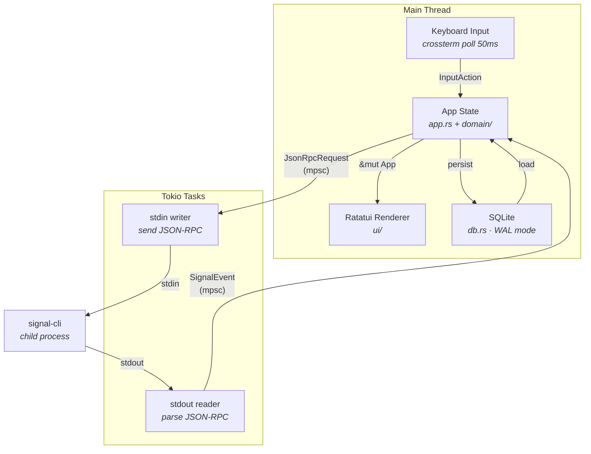
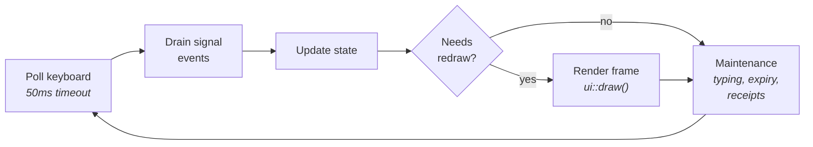
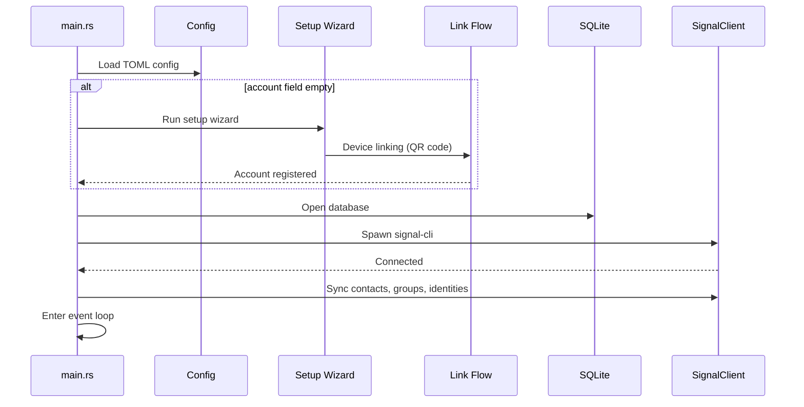

# Architecture

## Overview

siggy is a terminal Signal client that wraps
[signal-cli](https://github.com/AsamK/signal-cli) via JSON-RPC over stdin/stdout.
It is built on a Tokio async runtime with Ratatui for rendering.

## Async runtime

The application uses a **multi-threaded Tokio runtime** (via `#[tokio::main]`).
The main thread runs the TUI event loop. signal-cli communication happens in
spawned Tokio tasks that communicate back to the main thread via
`tokio::sync::mpsc` channels.

## Event loop

The main loop in `main.rs` runs on a 50ms tick:

This keeps the UI responsive while processing backend events as they arrive.

## Startup sequence

## Key dependencies

| Crate | Purpose |
|---|---|
| `ratatui` 0.30 | Terminal UI framework |
| `crossterm` 0.29 | Cross-platform terminal I/O |
| `tokio` 1.x | Async runtime |
| `serde` / `serde_json` | JSON serialization for signal-cli RPC |
| `rusqlite` 0.40 | SQLite database (bundled) |
| `chrono` 0.4 | Timestamp handling |
| `qrcode` 0.14 | QR code generation for device linking |
| `image` 0.25 | Image decoding for inline previews |
| `icy_sixel` 0.5 | Sixel image encoding |
| `arboard` 3.x | Clipboard access for /paste (with Wayland data-control) |
| `argon2` 0.5 | Session-lock passphrase hashing |
| `notify-rust` 4.x | Desktop notifications |
| `emojis` 0.9 | Emoji lookup and shortcodes |
| `open` 5.x | Open attachments/URLs in the OS default app |
| `anyhow` 1.x | Error handling |
| `toml` 1.x | Config file parsing |
| `dirs` 6.x | Platform-specific directory paths |
| `uuid` 1.x | RPC request ID generation |
