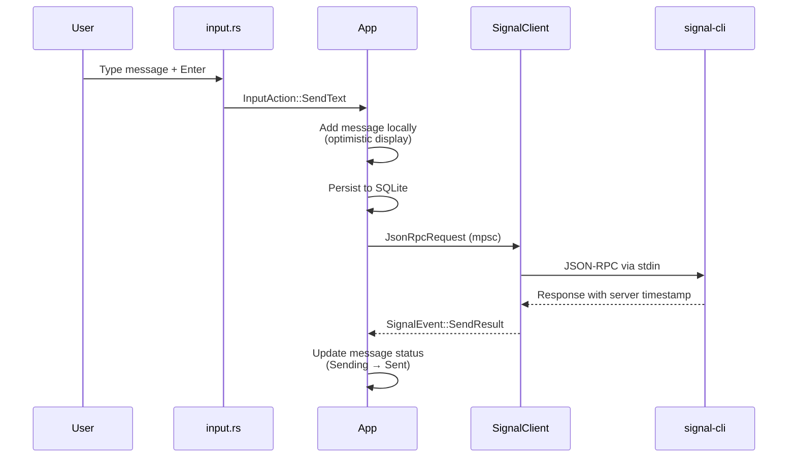
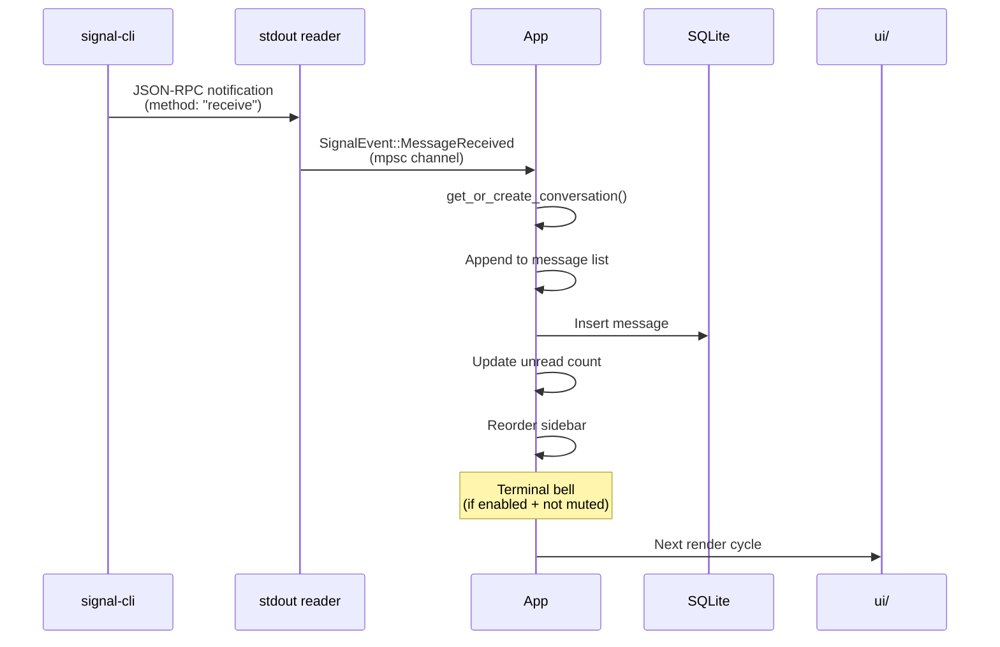
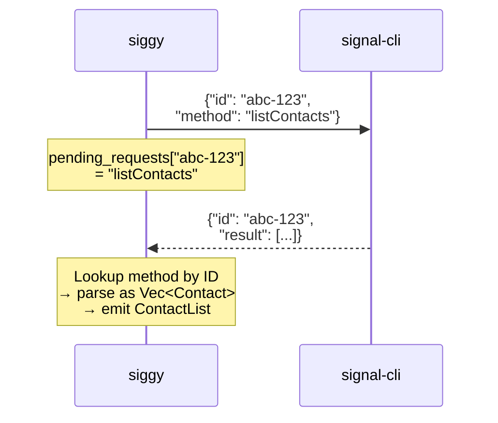
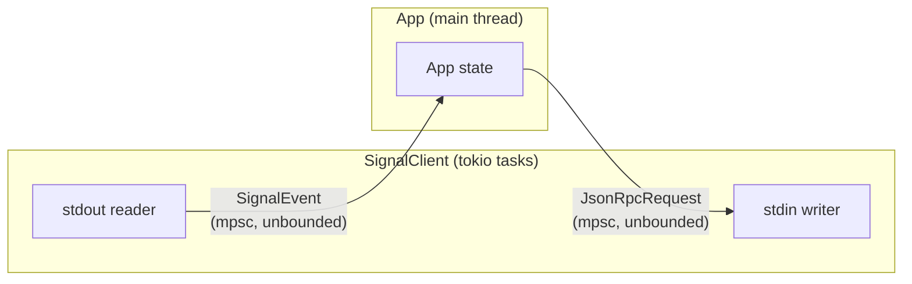

# Data Flow

## Outbound messages (user sends)

The request is a JSON-RPC call to the `send` method with the recipient and
message body as parameters. Each request gets a unique UUID as its RPC ID.

## Inbound messages (received)

## RPC request/response correlation

signal-cli uses JSON-RPC 2.0. There are two types of messages:

### Notifications (incoming)

Notifications arrive as JSON-RPC **requests** from signal-cli (they have a
`method` field). These include:

- `receive` - incoming message
- `receiveTyping` - typing indicator
- `receiveReceipt` - delivery/read receipt

These are unsolicited and do not have an `id` field matching any outbound request.

### RPC responses

When siggy sends a request (e.g., `listContacts`, `listGroups`, `send`),
signal-cli replies with a response that has a matching `id` field and a `result`
(or `error`) field.

The `pending_requests` map in `SignalClient` stores `id → method` pairs. When
a response arrives, the client looks up the method by ID to know how to parse
the result.

## Sync messages

When you send a message from your phone, signal-cli receives a sync notification.
These appear as `SignalMessage` with `is_outgoing = true` and a `destination`
field indicating the recipient. The app routes these to the correct conversation
and displays them as outgoing messages.

## Channel architecture

Both channels are unbounded `tokio::sync::mpsc` channels. The signal event
channel carries `SignalEvent` variants. The command channel carries
`JsonRpcRequest` structs to be serialized and written to signal-cli's stdin.
