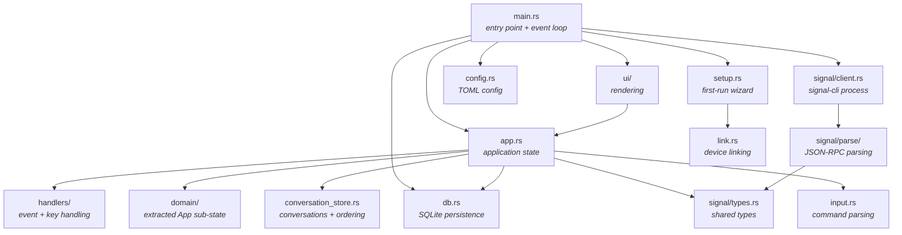

# Module Reference

siggy is organized under `src/` with a few submodule trees (`handlers/`,
`domain/`, `signal/`, `ui/`) around a flat core.

## Module dependency graph

## Source files

### `main.rs`

Entry point. Parses CLI arguments (including the non-interactive
`--version` / `--check` / `--send` / `--list` / `--receive` /
`--reset-account` / `--reset-lock` modes), runs the setup wizard if needed,
opens the database, spawns signal-cli, and runs the main event loop.

The event loop polls keyboard input (50ms timeout), drains signal events from
the mpsc channel, and renders each frame with `ui::draw()`. `dispatch_send()`
routes each `SendRequest` variant to its `SignalClient` RPC method, so
handlers stay synchronous and the main loop owns all async I/O. A supervisor
respawns signal-cli with backoff if the child exits.

### `app.rs`

Application state. The `App` struct holds the mode (Normal / Insert), the
active conversation, and sub-structs extracted into `src/domain/`. A CI
ratchet (`scripts/check-app-field-count.sh`) fails PRs that grow the direct
field count past its committed baseline, which forces new state into
`domain/` sub-structs.

### `conversation_store.rs`

`ConversationStore`: the conversation map (`HashMap` keyed by phone number or
group ID), the ordered `Vec` for sidebar display, contact/UUID name lookups,
and read markers. `get_or_create_conversation()` is the single point for
ensuring a conversation exists -- it upserts to both memory and SQLite.

### `handlers/`

Event and key handling extracted from `app.rs`:

- `handlers/signal.rs` -- `handle_signal_event()`, the single entry point for
  all backend events (messages, receipts, typing, contact/group lists,
  errors).
- `handlers/input.rs` -- composer text to `SendRequest` (send, edit, poll,
  archive, export, and the other slash-command arms).
- `handlers/keys.rs` -- global, Normal-mode, Insert-mode, overlay, and mouse
  handlers.

### `domain/`

Extracted `App` sub-state, one module per concern: scroll, input, pending
sends, overlays, image cache, lock, typing, search, mouse hit-areas, media
(download dir + audio player), and the shared `SendRequest` value type.
`domain/` is a leaf layer: it does not import from `app::`.

### `signal/client.rs`

Spawns the signal-cli child process and manages communication. Two Tokio
tasks:

- **stdout reader** -- reads lines from signal-cli stdout, parses JSON-RPC
  into `SignalEvent` variants, and sends them through the mpsc channel
- **stdin writer** -- receives `JsonRpcRequest` structs and writes them as
  JSON lines to signal-cli stdin

The `pending_requests` map tracks RPC call IDs to correlate responses with
their original method (e.g., mapping a response ID back to `listContacts`).
All `send_*` methods build params and go through a shared `send_rpc` helper.

### `signal/parse/`

JSON-RPC to `SignalEvent` parsing, split by concern: `envelope.rs`,
`message.rs`, `helpers.rs` (attachments, mentions, text styles), `rpc.rs`,
and `poll.rs`.

### `signal/types.rs`

Shared types for signal-cli communication:

- `SignalEvent` -- enum of all events the backend can produce
- `SignalMessage` -- a message with source, timestamp, body, attachments, group info, text styles
- `TextStyle` / `StyleType` -- text formatting ranges (bold, italic, strikethrough, monospace, spoiler)
- `Attachment` -- file metadata (content type, filename, local path)
- `JsonRpcRequest` / `JsonRpcResponse` -- JSON-RPC protocol structs
- `Contact` / `Group` -- address book and group info

### `ui/`

Rendering: `mod.rs` (`draw()`), `chat_pane.rs`, `sidebar.rs`,
`status_bar.rs`, `composer.rs`, `overlays/` (one file per overlay), and
`links.rs` (URI span styling and the OSC 8 hyperlink post-render pass).

Note that `draw()` takes `&mut App`: it writes layout feedback (scroll
clamping, focus derivation, mouse hit-rects) during render.

### `db.rs`

SQLite database layer with WAL mode. Tables: `conversations`, `messages`,
`read_markers`, `reactions`, `poll_votes`. Schema migration is a static,
version-based table (currently at v15, see [Database Schema](database.md)).

Provides `open()` for disk-backed storage and `open_in_memory()` for
incognito mode.

### `config.rs`

TOML configuration serialized with serde. Core fields: `account` (E.164
phone), `signal_cli_path`, `download_dir`, `db_path`, plus UI and behavior
preferences (`image_mode`, `theme`, `lock_timeout`, `audio_player`,
notification toggles, and more -- see
[Configuration](../user-guide/configuration.md) for the full table). All
fields have serde defaults so old config files keep loading.

### `input.rs`

Input parsing. Converts composer text into an `InputAction` enum, covering
every slash command and its aliases, and defines `CommandInfo` / the
`COMMANDS` constant used by autocomplete and `/help`. Part of the fuzzable
lib target (`fuzz_command_parse`, `fuzz_input_edit`).

### Other modules

- `audio.rs` -- inline voice-message playback via a detected CLI player
- `compose.rs` -- composer markup parsing (`*bold*` etc.) to Signal style ranges
- `export.rs` -- `/export` rendering (plain text, Markdown, JSON)
- `autocomplete.rs` -- command and @mention completion state
- `list_overlay.rs` -- shared list-overlay key/nav/scroll helpers
- `keybindings.rs` / `theme.rs` -- keybinding profiles and color themes (both TOML-extensible)
- `image_render.rs` -- halfblock/Kitty/iTerm2/Sixel image rendering
- `mute.rs` -- mute state (permanent and timed)
- `debug_log.rs` -- optional file logger gated by `--debug`
- `demo.rs` -- `--demo` dummy data
- `fs_migrate.rs` -- signal-tui to siggy path migration

### `setup.rs`

Multi-step first-run wizard. Handles signal-cli detection (searching PATH),
phone number input with validation, relink safety checks against existing
local data, and triggers the device linking flow.

### `link.rs`

Device linking flow. Runs signal-cli's `link` command, captures the QR code
URI, renders it in the terminal, and waits for the user to scan it with
their phone. Surfaces signal-cli's stderr on failure with recovery guidance
(e.g. the 409 device-conflict case).
