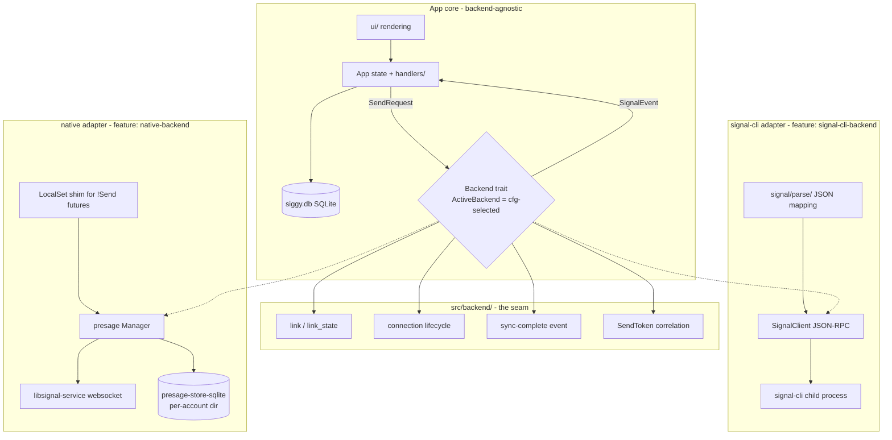
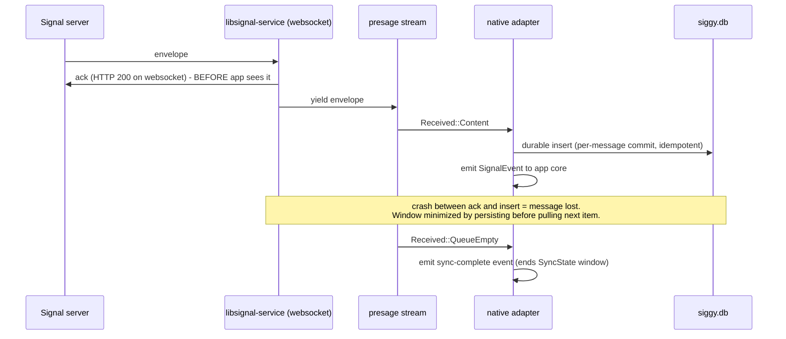
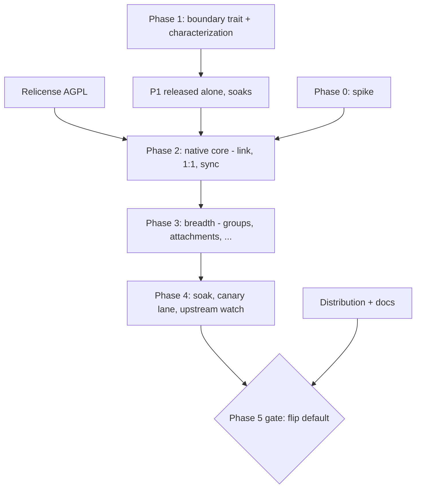

# Native Backend (presage) - Plan

## Goal Capsule

- **Objective:** Implement RFC #635 — an opt-in, in-process Signal backend built on presage behind a `native-backend` Cargo feature, with the existing signal-cli backend remaining the default until native reaches parity, then flipping the default with signal-cli retained as a supported fallback.
- **Authority hierarchy:** RFC #635 (product decisions, already accepted) > this plan (implementation decisions) > implementer judgment (execution-time detail). Product-scope changes go back to the issue, not into PRs.
- **Execution profile:** Multi-phase, multi-PR epic executed piece by piece by one developer per issue. Every phase lands through the repo's standard workflow: feature branch → `cargo clippy --tests -- -D warnings && cargo test` → PR → CI → squash merge.
- **Stop conditions:** Stop and surface (do not guess) when: the pinned presage rev cannot link/send/receive against production Signal (spike gate); a Phase 1 characterization test cannot be made to pass without changing observable behavior; upstream presage churn requires >1 day of adapter porting; anything requires weakening the data-loss posture in KTD-2.
- **Tail ownership:** Phase 5 (default flip) has an explicit gate checklist in Definition of Done — it is a decision point, not an automatic consequence of finishing Phase 4.

---

## Product Contract

### Summary

siggy currently requires users to install signal-cli, a Java application, which siggy drives over JSON-RPC as a child process. This plan adds a second backend that speaks the Signal protocol in-process via presage (whisperfish's Rust library over Signal's official `libsignal`), selected at compile time by mutually exclusive Cargo features. The end state is a pure-Rust siggy with no JVM at runtime for default users, reached through a phased migration that never breaks existing users: characterize and refactor the working backend behind a boundary first, prove the native backend against that boundary, reach parity, then flip.

### Problem Frame

The signal-cli dependency is siggy's single biggest install and operational friction: a separate Java runtime to install, a setup wizard step to locate the binary, subprocess lifecycle management, and stdio plumbing. It contradicts the product pitch (lightweight, no heavy runtime). Prior art (gurk-rs) proves a presage-based Rust TUI is viable long-term.

### Requirements

**Backend boundary**

- R1. A backend-agnostic messaging boundary exists: the app core (App state, handlers, UI, DB) compiles and behaves identically regardless of which backend is active, communicating only via siggy's own event/request types.
- R2. Backend selection is compile-time via mutually exclusive Cargo features `signal-cli-backend` (default) and `native-backend`; enabling both or neither is a `compile_error!`.
- R3. The signal-cli backend's observable behavior is preserved through the boundary refactor, proven by characterization tests written before the refactor.
- R4. Linking, registration-detection ("am I linked?"), and connection lifecycle are first-class boundary operations, not process-behavior inferences.

**Native backend capability**

- R5. Native backend links as a secondary device (QR flow), sends and receives 1:1 messages, and syncs contact/profile names.
- R6. Native backend reaches functional parity with everything siggy ships today — groups (send/receive), attachments, reactions, quotes/replies, edits, remote delete, typing indicators, receipts, disappearing timers — or documents each gap as an explicit capability difference (group *admin* operations are a known presage gap).
- R7. Incoming messages under the native backend survive an app crash with at most the narrow acked-before-persisted window inherent to presage's websocket layer: siggy persists each message durably before processing continues, and duplicate redelivery is idempotent (dedup).
- R8. Headless CLI modes (`--send`, `--receive`, `--watch`, `--check`) work under both backends; `--check` and `--version` identify the active backend.

**Migration & operations**

- R9. A user upgrading across the default flip gets an explicit interstitial explaining the relink requirement (new linked device, device-cap implications, local history preserved) — never a bare QR screen.
- R10. The repo relicenses GPL-3.0-only → AGPL-3.0-only (required by the native dependency tree; decided in the RFC).
- R11. CI builds, lints, and tests both feature configurations; the native lane is allowed-to-fail during Phases 0–2 and required-green from Phase 3.
- R12. Distribution honestly reflects the crates.io constraint: `cargo install siggy` remains the signal-cli build; native ships via GitHub release binaries / install script / `cargo install --git`; docs state build prerequisites (`protoc`) for the native feature.
- R13. A nightly cross-backend canary (native ↔ signal-cli over production Signal, notify-not-block) and an upstream-watch job against the presage pin exist before the default flip, per the RFC's testing/maintenance design.

### Scope Boundaries

**Deferred to follow-up work**

- Windows native build. No evidence presage/libsignal-service builds or runs on Windows in any consumer; signal-cli remains the documented Windows backend indefinitely. Revisit only after native is default on Linux/macOS.
- Group admin operations (create/rename/invite/kick) on native — presage has no API for them today; capability-gated with clear UX copy until upstream support exists.
- Full removal of the signal-cli backend (explicitly out of the RFC's scope; separate future decision).
- Vendoring presage or pushing it toward crates.io publication.

**Outside this product's identity**

- Reimplementing any cryptography.
- A state importer between signal-cli's and presage's protocol stores (separate device registrations by design).
- Runtime backend switching (two build flavours, not a toggle).

---

## Planning Contract

### Key Technical Decisions

- KTD-1. **Static dispatch, not trait objects.** Because the features are mutually exclusive, exactly one backend exists per binary. The boundary is a `Backend` trait (for contract documentation and test mocks) plus a cfg-selected concrete type (`#[cfg(feature = "signal-cli-backend")] pub use signal_cli::SignalCliBackend as ActiveBackend;`). No `dyn`, no enum dispatch across backends, zero runtime cost, and the dead backend's dependency tree is never compiled. The existing private `MessagingBackend` enum in `src/main.rs` (Signal/Demo) is the seed: it gets promoted to `src/backend/`, `Demo` stays as a variant-like no-op.
- KTD-2. **At-least-once + dedup + persist-fast; accept the ack window.** Verified upstream: libsignal-service acks each envelope on the websocket *before* yielding it to the stream ("Envelopes yielded are acknowledged", `messagepipe.rs`), so ack-after-durable-write is not implementable without forking. The contract: the native adapter persists each incoming message before pulling the next stream item, and message insertion is idempotent so any redelivery or replay is harmless. "Durable" means app-crash durable — siggy runs SQLite at `synchronous=NORMAL` (WAL), so a committed insert survives kill -9 but not power loss; the adapter's own connection may commit at `synchronous=FULL` if the stronger guarantee proves cheap (decided in U6). The residual risks — a crash inside presage's own decrypt path, and the acked-in-flight envelope — are documented, not hidden. Confirmed with the maintainer at plan time.
- KTD-3. **Linking, link-state, and connection lifecycle enter the boundary.** Today "am I linked?" is inferred four ways (500ms child-exit sniff, `listContacts` exit code, stderr regex, and `--check` not actually checking). The trait gets `link_state()`, `link()` (yields a provisioning URI for the existing QR renderer), and typed connection events. Both adapters implement them; `--check` is rewritten on top and stops lying.
- KTD-4. **Send correlation becomes a backend-neutral `SendToken`.** signal-cli's `rpc_id` currently leaks into `app.pending.sends` and paste-cleanup tracking. The token becomes opaque at the boundary; natively the caller-chosen timestamp *is* the wire timestamp (the local→server rewrite dance becomes a no-op), and the adapter synthesizes `SendTimestamp`/`SendFailed` from the send future's result plus a 30s timeout (native has no eventually-answering RPC peer; a hung websocket must not leave messages in Sending forever). Two corollaries: the native adapter generates send timestamps as `max(now_ms, last_sent + 1)` so tokens are strictly increasing and unique (two sends in one millisecond must not collide in `pending.sends` or in Signal's own (sender, ts) message identity); and a timed-out send future is not dropped — a late `Ok` still emits `SendTimestamp` and upgrades the message Failed→Sent via the dedicated status path (per the #486 lesson, this transition needs its own route past the monotonic guard).
- KTD-5. **Sync lifecycle becomes an explicit boundary event.** presage's `Received::QueueEmpty` is a *better* end-of-sync signal than siggy's wall-clock `SyncState` heuristic (≥10s uptime + 3s quiet), which is tuned to signal-cli's burst cadence. The boundary emits a sync-complete event: the native adapter maps QueueEmpty to it; the signal-cli adapter keeps the heuristic internally and emits the same event. Notification suppression, read-receipt gating, and `app.loading` all key off the event. Reconnect re-opens a sync window (dedup from KTD-2 must be active before notification policy runs, or reconnects replay notification storms).
- KTD-6. **Conversation identity canonicalizes to the current signal-cli formats.** siggy.db keys conversations by E.164 / ACI uuid / base64 group id exactly as signal-cli renders them. The boundary contract pins these formats; the native adapter converts presage identities (ServiceId, group master keys) *into* them, so the DB stays backend-agnostic and a user's history survives a backend switch. A characterization test locks the format. Format identity is not enough — the *selection rule* is also pinned: a peer keys by E.164 when the store knows their number, else by ACI uuid. Because a message can arrive before contact sync supplies the number (freshly linked native device), the native adapter must detect and re-key/merge a uuid-keyed conversation into the E.164-keyed one when the number later becomes known, or history silently splits; U11 carries the race test.
- KTD-7. **Pin presage to a specific git commit; bumps are planned migrations.** presage has no crates.io releases (git-only; latest tag 0.7.0, main is 0.8.0-dev) and real API churn (store backend swap, `ReceivingMode` removal, websocket refactor). Start from the rev gurk pins (or newer if the linking fix requires it), record the rev and its rationale in the adapter module docs, and never track HEAD. The workspace root carries the required `[patch.crates-io]` curve25519-dalek entry; CDSI stays off (avoids BoringSSL/cmake).
- KTD-8. **Native adapter mirrors gurk's proven shape internally.** One module (`src/backend/native/`), a `LocalSet`/local-pool shim for presage's partially `!Send` store futures, presage-store-sqlite (the only maintained store; sled is removed upstream) in its own per-account directory — separate from siggy.db, never mixed. Inside that module, staying close to presage's mental model is encouraged (makes porting upstream diffs mechanical); outside it, nothing presage-shaped leaks.
- KTD-9. **Relicense the whole repo AGPL-3.0-only in one isolated, mechanical PR** (LICENSE swap, `license = "AGPL-3.0-only"` SPDX id, README, credits, courtesy contributor heads-up in the PR). Landed early (before any presage code merges) so no AGPL-linked artifact ever ships under the wrong license.
- KTD-10. **Capability flags, not silent gaps.** The boundary exposes static capabilities (e.g. `supports_group_admin()`); UI paths check them and render honest copy ("not supported by the native engine yet") instead of failing opaquely.

### High-Level Technical Design

Component topology — where the boundary cuts, and what moves behind it:

Native receive path and the ack window (the load-bearing sequence):

Phase dependency graph (issues follow this order):

### Flow gaps and questions referenced by units

Legend for the flow-analysis identifiers cited in unit bodies (derived during planning; the analysis itself lives in the planning session, these are the load-bearing conclusions):

- G1: "am I linked?" is inferred four ways from process behavior (500ms child-exit sniff, listContacts exit code, stderr regex, `--check` not checking) — replaced by `link_state()` (KTD-3).
- G2: reconnect is process-supervision (respawn) with a 6-attempt cap and signal-cli-naming copy — wrong model for an in-process websocket.
- G4: first launch after the default flip must show a migration interstitial, never a bare QR screen.
- G5: native has no ContactList RPC round-trip to clear `app.loading`, and the wall-clock sync heuristic misfits QueueEmpty — the native startup status sequence must be defined.
- G7: signal-cli is named in essentially all failure copy and the wizard's first step — `display_name()` per backend.
- Q1: native store location default — platform data dir under `siggy/native/<account>/`, with reset/relink tooling taught the new path.
- Q4: reconnect retry policy — infinite with capped backoff for network-class errors; terminate with actionable copy only for auth-revoked/store-corrupt.

### Assumptions

- A1. presage's linking break against current Signal mobile (upstream #419) is fixed by PR #421 or equivalent before/during the spike; the spike issue carries this as its first gate and the pin may need to include that fix.
- A2. `Manager::send_message` resolving `Ok` means server-accepted (drives single-checkmark semantics and `--send` exit codes); the spike verifies this.
- A3. `Received::QueueEmpty` fires on each stream (re)open, so every reconnect gets a sync window; the spike verifies, and the sync-event contract tolerates either answer.
- A4. The pinned Rust toolchain (1.95.0) satisfies libsignal's MSRV (~1.89); the native feature raises siggy's *effective* MSRV for source builds and CONTRIBUTING's "1.70+" claim gets a per-feature caveat.

### Sequencing constraints

- The relicense PR (U20) merges before any PR that adds presage to Cargo.lock.
- Phase 1 releases alone and soaks (one normal release cycle of dogfooding) before Phase 2 merges native code on top — the boundary refactor can break existing users and must be trivially attributable.
- Characterization tests (U2) merge before any boundary refactor PR (U4–U5).
- Dedup (U6) lands before native receive (U11) — notification policy depends on it.

---

## Implementation Units

Unit index:

| U-ID | Title | Phase | Key files | Depends on |
|---|---|---|---|---|
| U1 | Spike: presage link/send/receive proof | P0 | scratch branch + `docs/solutions/` report | — |
| U2 | Characterization safety net for signal-cli behavior | P1 | `src/signal/parse/`, `src/app_tests.rs`, `src/db.rs` tests | — |
| U3 | Boundary vocabulary: SendToken, link/connection/sync events | P1 | `src/signal/types.rs`, `src/domain/pending.rs` | U2 |
| U4 | Backend trait + adapters module; move dispatch behind it | P1 | `src/backend/` (new), `src/main.rs` | U3 |
| U5 | Route bypass paths through the boundary | P1 | `src/main.rs`, `src/setup.rs`, `src/link.rs` | U4 |
| U6 | DB idempotency: message dedup + per-message durability path | P1 | `src/db.rs` | U2 |
| U7 | Cargo features, compile_error! guard, CI matrix | P1 | `Cargo.toml`, `.github/workflows/ci.yml`, `fuzz/` | U4 |
| U8 | Phase 1 soak release | P1 | release process | U2–U7 |
| U9 | Native crate plumbing: pinned presage, store, LocalSet shim | P2 | `src/backend/native/` (new), `Cargo.toml` | U1 (go verdict), U7, U8, U20 |
| U10 | Native linking + link_state + wizard/--check integration | P2 | `src/backend/native/`, `src/setup.rs`, `src/link.rs` | U9 |
| U11 | Native receive: stream→events, persist-fast, sync window, reconnect | P2 | `src/backend/native/` | U9, U6 |
| U12 | Native send 1:1 + contact/profile resolution | P2 | `src/backend/native/` | U11 |
| U13 | Native groups (send/receive; admin capability-gated) | P3 | `src/backend/native/` | U12 |
| U14 | Native attachments (send/receive, download-dir semantics) | P3 | `src/backend/native/` | U12 |
| U15 | Native reactions, quotes, edits, remote delete | P3 | `src/backend/native/` | U12 |
| U16 | Native typing, receipts, disappearing timers, message requests | P3 | `src/backend/native/` | U12 |
| U17 | Parity checklist + backend id + pre-flip native release + soak | P4 | `docs/`, `src/main.rs`, `.github/workflows/release.yml` | U13–U16 |
| U18 | Canary lane + upstream-watch automation | P4 | `.github/workflows/` | U13–U16 |
| U19 | Default flip + migration interstitial | P5 | `Cargo.toml`, `src/setup.rs`, docs, `.github/workflows/release.yml` | U17, U18, U21 |
| U20 | Relicense GPL-3.0-only → AGPL-3.0-only | cross | `LICENSE`, `Cargo.toml`, `README.md` | — |
| U21 | Distribution & docs for the two-build reality | cross | `install.sh`, `docs/src/`, `README.md` | U7 |

### U1. Spike: presage link/send/receive proof

- **Goal:** Prove the four load-bearing unknowns on a scratch branch before any production code: (1) linking works against production Signal at a chosen presage rev (upstream #419/#421 gate), (2) send `Ok` semantics, (3) `QueueEmpty` behavior on initial and re-opened streams, (4) the `LocalSet`/`!Send` runtime shape coexists with siggy's Tokio main loop. Produce a written go/no-go report.
- **Requirements:** R5 (proof), assumptions A1–A3.
- **Dependencies:** none. **Not merged to master** — spike code is throwaway by policy; only the report lands.
- **Files:** scratch branch `spike/native-backend`; report at `docs/solutions/architecture/native-backend-spike-findings.md` (frontmatter per repo convention).
- **Approach:** Minimal binary (or `--features native-spike` bin target on the branch) that: opens presage-store-sqlite in a temp dir, runs `link_secondary_device` printing the provisioning URI (reuse `link::render_qr_lines`), receives to stdout, sends one message by E.164. Use a scratch Signal account (not the maintainer's primary), budget for the device-cap slot. Record: chosen rev + why; whether #421's fix is merged/cherry-picked; exact build prereqs observed (protoc, perl); binary size delta; time-to-first-message; whether `QueueEmpty` recurs on stream reopen; what `send_message` returns on an unreachable recipient; and — load-bearing for the data-loss contract — whether acks are coupled one-to-one with consumer pulls (no internal buffering between the messagepipe and the `receive_messages` stream), recording the observed maximum acked-but-unpersisted depth.
- **Execution note:** Timeboxed (suggest ~3 days of effort). Failure is a first-class outcome: a no-go report parks the epic cheaply.
- **Test scenarios:** none — spike code is not merged. The *report* must answer every question in the Approach list; unanswered = spike incomplete.
- **Verification:** Report committed; each open assumption (A1–A3) marked verified/refuted with evidence; go/no-go recommendation stated.

### U2. Characterization safety net for signal-cli behavior

- **Goal:** Lock the current backend's observable behavior in tests *before* the boundary refactor, so U4/U5 are provably correctness-neutral.
- **Requirements:** R3.
- **Dependencies:** none (can start immediately, parallel with U1).
- **Files:** `src/signal/parse/mod.rs` tests, new golden-fixture module (e.g. `src/signal/parse/fixtures/` with captured JSON-RPC frames), `src/app_tests.rs`, `src/db.rs` tests, `src/signal/client.rs` wire_tests (extend).
- **Approach:** Three characterization layers, per the repo's viewstate-refactor lesson (safety net first): (1) **golden JSON-RPC fixtures** — captured real frames (redacted) for every event type siggy handles, asserted through `parse_signal_event`/`parse_rpc_result` end-to-end (revives ideation item R6); (2) **conversation-id format lock** — tests asserting the exact id formats (E.164, ACI uuid fallback, base64 group id) that KTD-6 canonicalizes to; (3) **persisted-state assertions** — tests that reload from SQLite (not just in-memory state) for the send-confirm timestamp rewrite, the status ladder incl. Sending→Failed, and read markers (the monotonic-status-guard incident showed in-memory-only coverage hides DB bugs).
- **Patterns to follow:** existing `wire_tests` in `src/signal/client.rs` (wire-shape lock-in for #433/#503); `app()` rstest fixture; `parse_message_from_uuid_only_contact` as fixture-test template.
- **Test scenarios:** one golden fixture per SignalEvent-producing frame type (message, receipt, typing, reaction, edit, remote delete, group update, sync read, contact list, group list, identity list, user status, send response, send error); id-format lock for 1:1-by-phone, 1:1-by-uuid, group; DB-reload assertions for send confirm, send fail, receipt upgrade, out-of-order receipt (no downgrade).
- **Verification:** New tests pass against unmodified master; deleting any single characterization test is detectable (they're cited by U4/U5 PR descriptions as the regression gate).

### U3. Boundary vocabulary: SendToken, link/connection/sync events

- **Goal:** Introduce the backend-neutral types the trait needs, with no behavior change: `SendToken` (newtype replacing raw `rpc_id` strings in app state), `LinkState` (Unlinked / Linked / Corrupt), typed connection events, and an explicit sync-complete event.
- **Requirements:** R1, R4; KTD-3, KTD-4, KTD-5.
- **Dependencies:** U2.
- **Files:** `src/signal/types.rs`, `src/domain/pending.rs` (`pending.sends` keying), `src/handlers/signal.rs`, `src/app.rs` (paste-cleanup keying), `src/app_tests.rs`.
- **Approach:** Mechanical retype: `pending.sends: HashMap<SendToken, ...>`; `SendTimestamp`/`SendFailed` carry `SendToken`. Add `SignalEvent::SyncComplete` emitted by the signal-cli path when `SyncState::should_end()` fires (moving the decision point from App into the adapter contract is U4's job; this unit only creates the event and has `end_sync()` consume it). Keep `redacted_summary()` arms updated.
- **Execution note:** ~9 files mention `rpc_id`; do the rename in one focused PR, no logic changes riding along.
- **Test scenarios:** existing send-confirm/fail tests updated compile-only (behavioral assertions unchanged — that's the point); new test: `SyncComplete` event ends the sync window exactly as the old direct call did (notification digest fires once, deferred receipts flush).
- **Verification:** Full suite green; characterization tests from U2 untouched and green.

### U4. Backend trait + adapters module; move dispatch behind it

- **Goal:** Create `src/backend/` with the `Backend` trait shaped around siggy's needs, the cfg-selected `ActiveBackend` alias, and the signal-cli adapter wrapping today's `SignalClient`. `dispatch_send` moves behind it.
- **Requirements:** R1, R2 (trait half); KTD-1.
- **Dependencies:** U3.
- **Files:** `src/backend/mod.rs`, `src/backend/signal_cli.rs` (new); `src/main.rs` (`MessagingBackend` enum retires into the new module; `dispatch_send` moves); `src/lib.rs` (module export for fuzz).
- **Approach:** Trait methods grouped: lifecycle (`connect`, `shutdown`, `try_reconnect`, `link_state`, `link`), events (`drain_events` or an `event_rx()` accessor — keep the existing drain-into-App shape to avoid re-architecting the main loop), send operations (the ~25 `SignalClient` methods regrouped into a smaller surface where natural — do **not** mirror signal-cli's RPC granularity if two calls are always paired), capabilities (KTD-10), `display_name()` for user-facing copy (flow gap G7). signal-cli wire quirks (bare-string vs array recipients) stay inside the adapter. `Demo` becomes a trivial `Backend` impl, replacing the enum's no-op arms.
- **Patterns to follow:** the existing `MessagingBackend` enum's three methods are the seed shape; gurk's `SignalManager` trait + test double is the reference for trait-with-mock.
- **Test scenarios:** a `MockBackend` test double records dispatched requests — at least one test per `SendRequest` variant family asserting it reaches the right trait method; `Demo` behaves as before (snapshot suite unchanged); characterization suite green.
- **Verification:** `cargo test` green under default features; no behavior diff in manual TUI smoke (`--demo`).

### U5. Route bypass paths through the boundary

- **Goal:** The four flows that bypass the seam — headless CLI modes, startup orchestration/registration sniffing, reconnect supervision, and the linking flow — go through the trait, eliminating the process-lifecycle inferences (flow gaps G1, G2, G7 partial).
- **Requirements:** R4, R8 (signal-cli half).
- **Dependencies:** U4.
- **Files:** `src/main.rs` (`run_send_oneshot`, `run_receive_stream`, `run_watch`, `run_check`, `run_main_flow` startup, reconnect supervisor), `src/setup.rs` (wizard step gating hook), `src/link.rs` (split "obtain URI / await completion / check registered" from QR rendering).
- **Approach:** `--check` rewritten on `link_state()` (it currently reports "OK" without checking registration — fix the lie for both backends). Startup: replace the 500ms `wait_for_ready` + stderr sniff with `link_state()` where possible; keep signal-cli's implementation of `link_state()` as the existing probes, but *inside the adapter*. Reconnect: supervisor calls `backend.try_reconnect()`; retry policy parameterized so U11 can make network-class errors retry indefinitely; user-facing strings use `display_name()`.
- **Test scenarios:** `--check` exit codes: unlinked account → nonzero with actionable message; linked → zero (signal-cli adapter, mocked probe); oneshot send failure paths unchanged (existing tests); reconnect supervisor calls through the trait (mock backend counts attempts, backoff preserved).
- **Verification:** Characterization suite green; manual: `siggy --check` against the (currently unregistered) local account reports unlinked instead of OK.

### U6. DB idempotency: message dedup + per-message durability path

- **Goal:** Make incoming-message insertion idempotent and give adapters a per-message durable-write path, so at-least-once delivery (KTD-2) is safe before any native code exists.
- **Requirements:** R7 (DB half).
- **Dependencies:** U2 (persisted-state tests exist first).
- **Files:** `src/db.rs` (migration; conflict-aware insert path), `src/handlers/signal.rs` (incoming insert path + duplicate-effects gate), `src/main.rs` (drain-batch scoping), `src/app_tests.rs`.
- **Approach:**
  - **Dedup key: incoming rows only, sender included.** Signal timestamps are sender-chosen client clocks, so cross-sender same-millisecond collisions in a group are ordinary — a key without sender silently deletes real messages (a missed dedup is a cosmetic duplicate; a wrong dedup is unrecoverable). Signal's own message identity is (sender, sent-timestamp), and the reactions table's unique key already includes `target_author` for this reason. The index is a *partial* unique index on `(conversation_id, sender_id, timestamp_ms)` restricted to incoming rows (`sender <> 'you' AND sender_id <> ''` — `sender` is never updated, so the predicate is stable). Outgoing rows are deliberately excluded: the #480 timestamp-rewrite dance updates outgoing `timestamp_ms` and would violate or be corrupted by a covering index.
  - **Insert semantics:** not blanket INSERT-OR-IGNORE (it swallows unrelated constraint violations, masking real bugs) — a conflict-targeted upsert (`ON CONFLICT ... DO NOTHING`) whose changed-row count is the "was it new?" result. On duplicate, callers skip the *full* side-effect chain: in-memory append, notification, unarchive, and sidebar move-to-top. Outgoing/sync-transcript rows (`sender = 'you'`, e.g. the sync echo of your own send replayed on reconnect) get an app-level exists-check inside the same transaction instead.
  - **Migration is dedupe-first, same transaction.** Creating a unique index over a populated table with pre-existing duplicates fails the migration and bricks startup on upgrade day. The migration deletes duplicates first keeping the oldest rowid per key (strict `rowid >` read-marker comparisons can then only shrink unread counts, never inflate them), then creates the index. Never edit existing migrations; log a line for the one-time index-build pause on large histories.
  - **Connection topology (settled here, not in U11):** the native adapter owns a *second* SQLite connection for `durable_insert`; `busy_timeout` is set on both connections (none is set today); and the native build's main-loop drain does **not** use `begin_batch` — the end-of-drain batch becomes signal-cli-adapter-internal. Without this, per-message inserts from the adapter thread hit `SQLITE_BUSY` exactly when the app is busiest. On timeout: retry, never drop.
  - **Durability level:** commits are app-crash durable (`synchronous=NORMAL`, WAL — same as every siggy write). If power-loss durability is wanted for this path, the adapter's own connection can run `synchronous=FULL` at negligible cost since it's dedicated; decide by measurement in the PR and document the choice.
- **Execution note:** This changes hot-path DB behavior for existing users — implement test-first against the U2 persisted-state suite, and keep it a standalone PR. Revert is only safe *before* release: after shipping, a binary downgrade runs old plain-INSERT code against the still-indexed DB and legitimate replays start erroring (silent-loss class). Post-release rollback is roll-forward (a migration dropping the index); the PR body must state this and the manual `DROP INDEX` escape hatch.
- **Test scenarios:** duplicate incoming frame (same conv/sender/ts) inserted twice → one row, one in-memory entry, one notification, no unarchive/reorder on the replay; distinct senders same timestamp in a group → both rows survive; migration on a `db_at_version` fixture seeded with duplicate incoming rows → dedupes keeping oldest, index created, unread counts not inflated; timestamp rewrite to a ts equal to an existing *incoming* row's ts → succeeds; duplicate sync-transcript replay of own send → one row via the app-level check; `durable_insert` on the adapter connection succeeds while the main connection holds an open batch; existing #480 rewrite reload assertions still green.
- **Verification:** U2 DB-reload characterization tests green; migration tested against a copy of a real siggy.db; both-connection concurrency test green.

### U7. Cargo features, compile_error! guard, CI matrix

- **Goal:** The two mutually exclusive features exist and are enforced; CI builds and tests both configurations.
- **Requirements:** R2, R11.
- **Dependencies:** U4 (module boundaries exist to gate).
- **Files:** `Cargo.toml` (`[features]`, `default = ["signal-cli-backend"]`, docs.rs metadata pinning a working feature set, `include` allowlist check), `src/main.rs` or `src/lib.rs` (compile_error! guard), `.github/workflows/ci.yml`, `fuzz/Cargo.toml`, `CONTRIBUTING.md`.
- **Approach:** Guard: `#[cfg(all(feature = "signal-cli-backend", feature = "native-backend"))] compile_error!(...)` and the neither-case twin. CI: add explicit `--no-default-features --features native-backend` clippy+test lanes (matrix dimension, `continue-on-error: true` until Phase 3) — until U9 lands the native feature gates only the boundary module, so the lane is cheap. The default lane gains `--locked` on its build/test invocations so it can serve as the lockfile canary U9 depends on. Preserve the four required-check job names exactly as branch ruleset 13341653 requires them: `Lint`, `Test (ubuntu-latest)`, `Test (macos-latest)`, `Test (windows-latest)` — new native lanes are additional jobs, not renames of these. Per-feature `Swatinem/rust-cache` keys. Fuzz crate: pin it to the default feature explicitly (fuzz_json_rpc fuzzes the signal-cli parser; document that native parsing gets fuzz coverage later if warranted).
- **Test scenarios:** `Test expectation: none -- CI/config unit`; verification is the matrix itself: both feature lanes compile+lint+test on ubuntu; the both-features and no-features builds fail with the compile_error message.
- **Verification:** CI green on a PR exercising all lanes; `cargo build --all-features` failing loudly is *expected and documented* in CONTRIBUTING.

### U8. Phase 1 soak release

- **Goal:** Ship the boundary refactor alone (no native code) as a normal release so regressions in the refactor are attributable before native lands on top.
- **Requirements:** R3.
- **Dependencies:** U2–U7 merged.
- **Files:** `Cargo.toml` version bump; standard tag-driven release.
- **Approach:** Normal release process (semver minor). Release notes explicitly say "internal backend refactor, no user-facing changes — please report anything odd". Soak = at least one normal release cycle of maintainer dogfooding (guideline: ~2 weeks) with no boundary-attributed regressions before U9 merges.
- **Test scenarios:** `Test expectation: none -- release checkpoint`.
- **Verification:** Release shipped; soak window elapsed; zero open regressions labeled against the refactor.

### U9. Native crate plumbing: pinned presage, store, LocalSet shim

- **Goal:** The `native-backend` feature compiles a real skeleton: pinned presage + presage-store-sqlite deps, workspace `[patch.crates-io]`, per-account store directory, and the async-runtime shim for presage's `!Send` futures. No user-visible capability yet.
- **Requirements:** R5 (foundation); KTD-7, KTD-8.
- **Dependencies:** U1 (go verdict), U7, U8 (soak done), U20 (license flipped before AGPL deps merge).
- **Files:** `Cargo.toml`, `src/backend/native/mod.rs`, `src/backend/native/store.rs` (path resolution), `src/backend/native/runtime.rs` (LocalSet shim); `.github/workflows/ci.yml` (protoc install step for native lanes); `docs/src/dev-guide/` build-prereqs note.
- **Approach:** Pin the spike-validated rev. Store lives at the platform data dir under `siggy/native/<account>/` (flow question Q1's default), created via the existing `set_dir_permissions` 0700 helper — it holds live Signal identity private keys and session state, strictly more sensitive than anything siggy stores today; tighten after presage-store-sqlite creates its files if its defaults are looser. `account_exists_locally` / `delete_local_account_data` / `--reset-account` learn to dispatch per backend so the #603 relink guard keeps working. Runtime shim per gurk's `local_pool`: a dedicated thread running a `LocalSet` that owns the Manager, communicating with the main loop via the same mpsc shapes the trait already defines. Confirm the `[patch.crates-io]` entry doesn't break the signal-cli-only build — U7's CI work adds `--locked` to the default lane's build/test invocations so that lane serves as the lockfile canary.
- **Test scenarios:** store path resolution per-account (unit); store directory created with mode 0700 (unit, Unix); reset/delete dispatches to the right store per compiled backend (unit, temp dirs); native lane compiles and links in CI with protoc installed.
- **Verification:** Both CI lanes green; binary size delta recorded in the PR body (RFC open question 6).

### U10. Native linking + link_state + wizard/--check integration

- **Goal:** A native-build user can link as a secondary device end-to-end through the existing wizard UX, and every "am I linked?" surface answers truthfully from the store.
- **Requirements:** R4, R5 (link), R8 (`--check`).
- **Dependencies:** U9.
- **Files:** `src/backend/native/linking.rs`, `src/setup.rs` (skip binary-detection step under native; gate `Step::SignalCli` on backend), `src/link.rs` (QR rendering reused as-is).
- **Approach:** `link()` = `Manager::link_secondary_device` with the provisioning URL delivered over its oneshot → rendered by `render_qr_lines`; await completion; map errors to typed boundary errors. `link_state()` = open store, inspect registration state. Device name "siggy" (matches current convention).
- **Test scenarios:** wizard step list under native excludes binary detection (unit on the step list); `link_state` on empty store → Unlinked; on populated store → Linked (integration against a temp store, no network); provisioning-URI-to-QR path (reuse existing `render_qr_lines` tests). Live linking is manual (Tier 3): one scripted checklist run against a scratch account.
- **Verification:** Manual link succeeds against production Signal on Linux and macOS; `--check` reports backend + link state.

### U11. Native receive: stream→events, persist-fast, sync window, reconnect

- **Goal:** Steady-state receive under native: presage stream mapped to `SignalEvent`s, each message durably persisted before the next is pulled (KTD-2), `QueueEmpty` driving the sync window (KTD-5), and a reconnect policy that treats network drops as routine.
- **Requirements:** R5 (receive), R7; KTD-2, KTD-5.
- **Dependencies:** U9, U6.
- **Files:** `src/backend/native/receive.rs` (Content→SignalMessage mapping), `src/backend/native/mod.rs` (stream task, reconnect).
- **Approach:** The LocalSet task consumes `receive_messages()`; per item: map → `durable_insert` (U6) → emit event → next. Identity mapping per KTD-6 (ServiceId→E.164-or-uuid string, group master key→base64 id — exact conversion validated against U2's id-format lock; selection rule E.164-when-known-else-uuid, with re-key/merge of a uuid-keyed conversation when contact sync later supplies the number). `QueueEmpty` → sync-complete event; native skips the wall-clock heuristic entirely; `app.loading` clears on store-load, not on a ContactList RPC round-trip (flow gap G5 — define the native startup status line sequence). Reconnect: stream end/error → typed connection event → supervisor retries indefinitely with capped backoff for network-class errors; auth-revoked/store-corrupt errors terminate with actionable copy (flow question Q4 default). Every reconnect opens a sync window; dedup makes replayed envelopes silent.
- **Execution note:** This is the unit where the data-loss contract lives — implement the persist-before-next-pull loop test-first, and torture-test per the Verification Contract's specified oracle and assertions (including the deterministic crash-injection hook: an env-var abort-after-N-inserts, so the acked-not-persisted boundary is hit on purpose, with random kill -9 kept as the chaos layer).
- **Test scenarios:** mapping unit tests per content type presage yields (message, receipt, typing, reaction, edit, delete, group update, sync read) mirroring U2's fixture list — same expected `SignalEvent` out; duplicate envelope replay → no double insert/notification; reconnect replay leg — after restart+reconnect, row count for already-delivered messages unchanged and zero notifications fire (this is the flip gate's "dedup proven under reconnect replay"); QueueEmpty → sync-complete → notification digest fires once; stream error → reconnect event → resubscribe → second QueueEmpty handled; contact-name resolution from store on first message; message arriving before contact sync keys by uuid, then contact sync supplies the number → conversation re-keyed/merged to E.164, no split (the KTD-6 race).
- **Verification:** Tier-3 manual: messages from a phone arrive live; restart after offline delivers backlog exactly once; kill -9 during a burst loses at most the in-flight envelope (documented window), never a persisted one.

### U12. Native send 1:1 + contact/profile resolution

- **Goal:** Sending 1:1 works with correct status semantics: timestamp-as-SendToken, synthesized SendTimestamp/SendFailed, 30s timeout, and recipient resolution (E.164, uuid, `u:username` per #612 semantics).
- **Requirements:** R5 (send); KTD-4.
- **Dependencies:** U11.
- **Files:** `src/backend/native/send.rs`.
- **Approach:** Send spawns onto the LocalSet; `Ok` → synthesize `SendTimestamp{token, ts}` (rewrite dance no-ops since local ts == wire ts — verify the receipt-before-confirm buffering path (#484) still holds); `Err` or 30s timeout → `SendFailed`. The sync echo of your *own* send replayed on reconnect is an outgoing-shaped insert outside the U6 unique index — it dedups via U6's app-level exists-check, not the index. Recipient conversion: conversation key string → ServiceId (reverse of KTD-6); `u:handle` resolves via `lookup_username`.
- **Test scenarios:** send Ok → status Sent, DB reload agrees; send Err → Failed (bypassing the monotonic guard via the dedicated failed-path, per the #486 lesson); timeout with no resolution → Failed at 30s; Ok resolving *after* the 30s timeout upgrades Failed→Sent exactly once (KTD-4); two sends inside the same millisecond get distinct, strictly-increasing timestamps (KTD-4); receipt arriving before confirm → buffered and applied (existing #484 tests re-pass under native mapping); username recipient resolves then sends.
- **Verification:** Tier-3 manual: two-way 1:1 conversation with a phone incl. checkmarks progressing Sent→Delivered→Read.

### U13. Native groups (send/receive; admin capability-gated)

- **Goal:** Group conversations work for daily use: receive and send in existing v2 groups, correct group identity mapping, member/mention resolution. Admin operations render honest capability copy.
- **Requirements:** R6 (groups); KTD-10.
- **Dependencies:** U12.
- **Files:** `src/backend/native/` (group mapping, `send_message_to_group`), group-menu UI paths (capability checks at existing call sites in `src/handlers/keys.rs` / `src/ui/overlays/group_menu.rs`).
- **Approach:** Group send via master-key bytes resolved from the canonical base64 group id; membership/mention uuid maps fed from the store. `supports_group_admin() == false` → group menu ops that mutate (create/rename/invite/kick/leave?) show "not supported by the native engine yet"; verify which ops presage actually supports at the pinned rev (leave/quit may work) and gate precisely, not wholesale.
- **Test scenarios:** group message in → correct conversation id (matches U2's format lock) and sender resolution; group send out → appears for other members (manual Tier 3); mentions render (uuid map populated from store); admin op under native → capability copy, no crash, no wire call.
- **Verification:** Daily-driver group usable natively; parity table rows updated with "last verified" entries.

### U14. Native attachments (send/receive, download-dir semantics)

- **Goal:** Attachments send and receive with the same on-disk layout and UX (download dir, filenames, image preview pipeline) as signal-cli.
- **Requirements:** R6 (attachments).
- **Dependencies:** U12.
- **Files:** `src/backend/native/attachments.rs`.
- **Approach:** Receive: `get_attachment` → write into `config.download_dir` matching current naming semantics (U2 characterization documents them) → `Attachment` struct as today so the image render pipeline is untouched. Sender-supplied filenames are attacker input crossing a new trust boundary: route them through the same sanitization the signal-cli path applies in `parse_attachment` (`src/signal/parse/helpers.rs` — extract to a shared helper; strip separators and traversal sequences, fall back to id-derived names). Send: `upload_attachment` from the existing file-picker path. Voice-note flagging preserved.
- **Test scenarios:** incoming image lands in download_dir with expected name and renders inline (mapping unit + manual); attachment with filename `../../.bashrc` (and an absolute-path variant) lands *inside* download_dir under a sanitized name; outgoing attachment with caption; attachment failure (missing blob) → message still renders with placeholder, no crash.
- **Verification:** Tier-3 manual round-trip both directions, image + non-image.

### U15. Native reactions, quotes, edits, remote delete

- **Goal:** The interactive message operations reach parity. presage stores these raw (no aggregation) — siggy's own aggregation (reactions table, edit handling, tombstones) does the work, fed by correctly mapped events.
- **Requirements:** R6.
- **Dependencies:** U12.
- **Files:** `src/backend/native/` (DataMessage construction for reaction/quote/edit/delete; incoming mapping already sketched in U11).
- **Approach:** Outgoing: build `DataMessage` bodies (reaction, quote, delete, edit) — caller-constructed per presage's model; reuse the exact semantics U2 characterized (e.g. edit targets, quote author formats). Incoming paths were mapped in U11; this unit closes the loop with sends and edge semantics.
- **Test scenarios:** react/unreact round-trip updates the reactions table identically to the signal-cli fixtures; quote carries author + preview text; edit rewrites body and marks edited; remote delete tombstones; each verified by DB reload.
- **Verification:** Tier-3 manual matrix vs a phone for all four ops, both directions.

### U16. Native typing, receipts, disappearing timers, message requests

- **Goal:** The ambient-protocol behaviors reach parity: typing indicators (both directions), delivery/read receipts (send + receive, honoring `send_read_receipts` config), disappearing-timer sync and countdown, message-request accept/delete/block semantics.
- **Requirements:** R6.
- **Dependencies:** U12.
- **Files:** `src/backend/native/` (ContentBody::TypingMessage / ReceiptMessage; timer handling is largely automatic via presage's expire-timer management — verify against siggy's `/disappearing` UX).
- **Approach:** Receipts: presage's receipt storage matured recently (upstream #409) — map its receipt events onto siggy's `ReceiptReceived` and verify the status ladder + buffering (#484) end-to-end. Timers: presage auto-manages `expire_timer` on send; siggy's timer-change UI must still emit the change message and reflect remote changes. Message requests: verify what presage exposes for unknown-sender flows; if the accept/block wire actions differ from signal-cli's `sendMessageRequestResponse`, map or capability-gate precisely.
- **Test scenarios:** typing start/stop both directions; read receipt sent only when `send_read_receipts` on; receipt in before send-confirm still buffers; timer set from siggy propagates (phone shows it) and vice versa; unknown sender → message-request UI → accept → normal conversation.
- **Verification:** Tier-3 manual matrix; parity table rows checked off with version stamps.

### U17. Parity checklist + backend identification + pre-flip native release + soak

- **Goal:** The Tier-3 manual parity protocol exists as a written, repeatable checklist; builds self-identify; native release artifacts ship in a pre-flip release; native soaks as the maintainer's daily driver.
- **Requirements:** R6 (verification), R8 (`--version` and the native half of `--send`/`--receive`/`--watch`), R12 (release artifacts proven pre-flip).
- **Dependencies:** U13–U16.
- **Files:** `docs/src/dev-guide/parity-checklist.md` (new; the RFC's parity table moves here as the living burndown with "last verified in vX.Y" columns), `src/main.rs` (`--version` → `siggy X.Y.Z (native|signal-cli)`; `--check` backend line), `.github/workflows/release.yml` (native artifact matrix additions land here, not in the flip PR), release-notes template.
- **Approach:** Checklist scoped to ~10 minutes with two accounts + one phone, covering what automation can't judge (trust flows, rendering, edge semantics) — including one row exercising `--send`/`--receive`/`--watch` under the native build (no other unit owns R8's native half). Release pipeline feasibility (protoc on release runners, libsignal on the macOS x86_64 cross target, artifact size) is proven *here*, in at least one pre-flip release publishing native binaries as opt-in artifacts — not discovered inside the flip PR. Soak = maintainer dogfoods native daily for an agreed window; bug reports must state backend (the `--version` string makes triage possible).
- **Test scenarios:** `--version`/`--check` output per feature build (unit); headless `--send`/`--receive` round-trip under the native build (checklist row, manual).
- **Verification:** Checklist run recorded for the current native build; every parity row has a "last verified" stamp or a linked gap issue; a pre-flip release contains downloadable native artifacts for Linux/macOS.

### U18. Canary lane + upstream-watch automation

- **Goal:** The Tier-2 cross-backend canary (native ↔ signal-cli over production Signal, nightly, notify-not-block) and the upstream-watch job (diff presage/libsignal-service against the pin; agent-drafted bump PRs) exist per the RFC's testing/maintenance design.
- **Requirements:** R13.
- **Dependencies:** U13–U16 (native basically works first — the RFC explicitly sequences this rig *after* breadth).
- **Files:** `.github/workflows/canary.yml`, `.github/workflows/upstream-watch.yml` (new), `docs/src/dev-guide/testing.md` (document the rig, its secrets, serialization, and the demote-without-guilt policy).
- **Approach:** Canary: two manually-registered test accounts; protocol stores cached as CI artifacts (keeps devices active past the 30-day unlink) — **encrypted**: on a public repo, workflow artifacts are downloadable by anyone with a GitHub account, and the stores hold the canary accounts' identity private keys, so the archive is symmetrically encrypted (e.g. age) with a key held in Actions secrets before upload and decrypted on restore, minimum retention, and the canary accounts are treated as compromise-tolerable test identities; concurrency group of one; headless harness drives the trait directly (`--send`/`--receive` modes may suffice — prefer reusing them over a new harness); send both directions, assert receipt; failures notify (issue comment), never gate merges; fork PRs can't see secrets by construction. Upstream-watch: scheduled job diffs the pinned rev vs upstream main, summarizes touched surfaces, opens a draft briefing issue; bump PRs are agent-drafted, human-verified (drafts only — the RFC's hard rule).
- **Execution note:** Budget for flake; the RFC pre-authorizes demoting the canary if it flakes more than it catches.
- **Test scenarios:** `Test expectation: none -- CI rig`; the rig's own dry-run (workflow_dispatch against the test accounts) is the acceptance test.
- **Verification:** One green scheduled canary run each direction; one upstream-watch briefing produced against a deliberately stale pin.

### U19. Default flip + migration interstitial

- **Goal:** `native-backend` becomes the default feature; upgrading users get an explicit migration interstitial (flow gap G4); signal-cli remains a supported, documented fallback build.
- **Requirements:** R9; Definition of Done gate below must be satisfied *first*.
- **Dependencies:** U17, U18, U21 — and the Phase 5 gate checklist.
- **Files:** `Cargo.toml` (default features), `src/setup.rs` + `src/main.rs` (first-launch-after-flip detection: config has account + no native store → interstitial screen, not a bare QR), `README.md`, `docs/src/` (install, troubleshooting, fallback path incl. honest re-link cost), `.github/workflows/release.yml` (default-artifact swap only — the native matrix additions already landed and shipped in U17), `install.sh` / `install.ps1`.
- **Approach:** Interstitial copy: what changed (built-in engine), what's needed (relink — new linked device), what's kept (local history in siggy.db), cleanup guidance (remove the old device on the phone; after that, the old signal-cli data directory can be deleted unless the user intends to keep the fallback build linked), and how to keep using signal-cli instead (fallback build install path). `signal_cli_path` config field stays inert for rollback. Release matrix: decide artifact naming (`siggy-native-*` vs default name flip) in the PR — the plan constraint is only that Windows keeps a working artifact and both flavours are downloadable.
- **Test scenarios:** upgrade simulation: config with account + empty native store → interstitial (unit on the routing decision); fresh install → normal wizard; `--setup` re-run under native never probes for a binary.
- **Verification:** The Phase 5 gate checklist (Definition of Done) is verified line-by-line in the flip PR body.

### U20. Relicense GPL-3.0-only → AGPL-3.0-only

- **Goal:** The repo license becomes AGPL-3.0-only before any AGPL-linked dependency merges.
- **Requirements:** R10; KTD-9.
- **Dependencies:** none. Merges before U9.
- **Files:** `LICENSE`, `Cargo.toml` (`license = "AGPL-3.0-only"` — exact SPDX id), `README.md` (license section + whisperfish/Signal credits), `CONTRIBUTING.md` (license-of-contributions line if present).
- **Approach:** One mechanical PR, no logic changes riding along (repo-hygiene lesson: isolate churn). PR body: rationale (RFC licensing section), GPLv3→AGPLv3 §13 compatibility note, courtesy @-mention of past contributors.
- **Test scenarios:** `Test expectation: none -- legal/metadata change`.
- **Verification:** `cargo package --list` shows the new LICENSE; crates.io metadata correct on next publish.

### U21. Distribution & docs for the two-build reality

- **Goal:** Users and contributors can discover, install, and build both flavours without surprises; documentation stops implying a single build.
- **Requirements:** R12.
- **Dependencies:** U7 (features exist).
- **Files:** `README.md`, `install.sh` (flavour selection or documented default), `docs/src/user-guide/` (install, FAQ, troubleshooting), `docs/src/dev-guide/architecture.md` + `protocol.md` (JSON-RPC contract becomes "signal-cli adapter internal"), `CONTRIBUTING.md` (build incantations: `--no-default-features --features native-backend`; protoc prerequisite; why `--all-features` fails), `Cargo.toml` docs.rs metadata.
- **Approach:** Written after U9 proves the real build requirements; updated again at U19. "No dependencies" claims become runtime claims explicitly. Includes the RFC-required security-posture line: under the native build, siggy's own process and data directory hold live Signal identity keys and session state (where signal-cli's process and data dir hold them today).
- **Test scenarios:** `Test expectation: none -- docs`; mdBook builds clean (docs.yml CI).
- **Verification:** A contributor following CONTRIBUTING cold can build both flavours (verified once manually).

---

## Verification Contract

| Gate | Command / protocol | Applies to |
|---|---|---|
| Lint | `cargo fmt --check` && `cargo clippy --tests -- -D warnings` | every PR, both feature lanes from U7 |
| Unit/integration tests | `cargo test` (default lane) and `cargo test --no-default-features --features native-backend` (native lane; allowed-fail during Phases 0–2, required-green from Phase 3 onward per R11) | every PR |
| Characterization suite | the U2 fixtures/tests — cited as the regression gate in every Phase 1 PR description; may not be weakened to make a refactor pass | U3–U8 |
| App field ratchet | `bash scripts/check-app-field-count.sh` (backend state lives in `src/backend/`, never as new App fields) | every PR |
| Data-loss torture test | Sender-side script keeps a manifest of (conversation, sender, timestamp) per message sent; adapter keeps a flushed append-only emit log. Crash via deterministic abort-after-N-inserts hook plus 10× random kill -9 during a burst. After restart assert: no duplicate incoming (conv, sender, ts) groups in siggy.db; manifest−DB difference ≤ the spike-measured maximum acked-unpersisted depth (expected 1 if acks couple one-to-one with pulls — U1 verifies; widen or tighten the bound to the measured depth) and any missing messages are the manifest's most recent; every emit-logged message is in the DB; `PRAGMA integrity_check` ok; unread counts match surviving rows. Replay leg: reconnect, then row counts unchanged and zero notifications for replayed envelopes | U11, and re-run in the U19 gate |
| Tier-3 parity checklist | `docs/src/dev-guide/parity-checklist.md` run against a phone + scratch account | any release touching the messaging layer, and the U19 gate |
| Canary lane | nightly cross-backend send/receive, both directions, notify-only | Phase 4 onward |
| Release sanity | existing release.yml build matrix green incl. any new native artifacts | U8, U19 |

---

## Definition of Done

**Per-phase:** each phase's units merged through the standard PR workflow, both CI lanes green (subject to the allowed-fail schedule), parity table updated, and no abandoned experimental code left in the tree (spike code stays on its branch).

**Phase 5 flip gate (all required before U19 merges):**

- Parity: every table row verified on the current native build or explicitly documented as an accepted capability difference (group admin ops), with trust/identity and group v2 rows given priority scrutiny.
- Data-loss contract: torture test passing 10/10; dedup proven under reconnect replay.
- Canary lane green over a 4-week soak with no silently-dropped-message class of failure.
- Maintainer has daily-driven native for the soak window.
- Native release artifacts already built and published in at least one prior (pre-flip) release (U17).
- Headless modes (`--send`, `--receive`, `--watch`, `--check`) verified under the native build (U17 checklist row).
- Distribution story shipped (U21) and fallback path documented honestly (JVM reinstall + re-link costs stated).
- Upstream health check: presage pin current within one planned bump; no open upstream regression that affects core paths.

**Epic done:** native is the default on Linux/macOS releases; signal-cli build remains supported, tested (its CI lane stays), and documented as the fallback and the Windows path; tracking issue closed with a summary comment linking the parity table.

---

## Risks & Dependencies

| Risk | Impact | Mitigation |
|---|---|---|
| presage linking broken upstream (#419) at spike time | P0 blocked | Spike gates on the #421 fix (merged or cherry-picked into the pin); no-go verdict is cheap and explicit |
| presage API churn between phases | Adapter rework mid-epic | Pin never moves except by deliberate bump PR; anti-corruption boundary confines blast radius to `src/backend/native/` |
| Boundary refactor regresses existing users | Worst-case outcome (breaks working product for zero new value) | Characterization-first (U2), one-PR-per-unit, U8 soak release before native merges |
| Acked-but-unpersisted crash window | Silent single-message loss | KTD-2 persist-fast + dedup minimizes; residual window documented; torture test bounds it |
| Duplicate-row edge in dedup key (same ts, two senders) | Wrong dedup drops a real message | U6's key includes sender and covers incoming rows only |
| Binary downgrade across the U6 migration | Old plain-INSERT code errors against the indexed DB → silent per-session loss | Downgrade hazard + `DROP INDEX` escape hatch documented in the U6 PR body; post-release rollback is roll-forward |
| Canary rig flake / Signal abuse systems | Noise, occasional manual re-link | Notify-not-block; tiny volume; RFC pre-authorizes demotion |
| MSRV / toolchain drift from libsignal bumps | CI breakage | Toolchain pinned; bumps via deliberate pin-bump PRs (repo-hygiene lesson) |
| Windows regression at flip | Windows users lose default path | Windows stays on signal-cli build in the release matrix; stated in R12/U19 |

---

## Sources & Research

- RFC: issue #635 (the product contract; all product decisions there are settled).
- Upstream verification (2026-07-07): presage main `0.8.0-dev`, sqlite-only store, `link_secondary_device`/`receive_messages`/`Received::QueueEmpty` API shapes; ack-before-yield confirmed in libsignal-service `src/messagepipe.rs` ("Envelopes yielded are acknowledged"); linking break #419 / fix PR #421; protoc + curve25519-dalek patch requirements; gurk-rs pins presage rev `600c4ede` (2026-04-19) with a `SignalManager` trait + local pool.
- Repo seams: `MessagingBackend` enum (`src/main.rs`), `SignalClient` surface (`src/signal/client.rs`), rpc_id leak (`src/domain/pending.rs`), drain-batch durability (`src/main.rs` begin/commit_batch), id formats (`src/conversation_store.rs`).
- Institutional learnings honored: monotonic-status-guard (per-transition status rules; test persisted state) — `docs/solutions/database-issues/`; viewstate-render-borrow-split (safety-net-first refactor method) — `docs/solutions/architecture/`; sync-viewport-stabilization (SyncState is signal-cli-shaped) and repo-hygiene (toolchain pin, required-check job names wired into branch ruleset 13341653, isolate mechanical churn) — `docs/superpowers/`.
